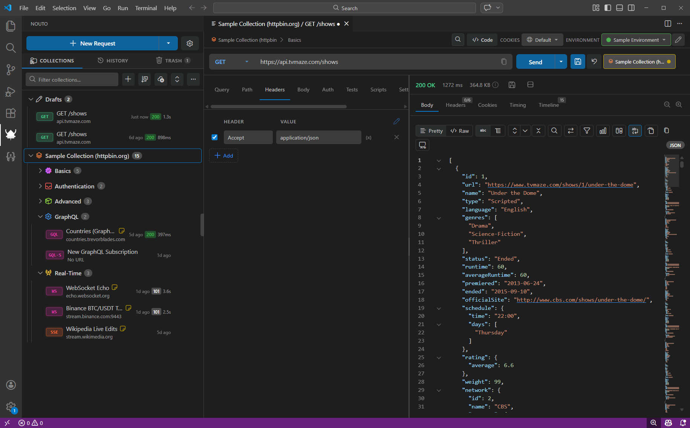

<p align="center">
  
</p>

<h1 align="center">Nouto</h1>

<p align="center">
  <a href="https://marketplace.visualstudio.com/items?itemName=frostybee-dev.nouto"></a>
  <a href="https://marketplace.visualstudio.com/items?itemName=frostybee-dev.nouto"></a>
  <a href="LICENSE"></a>
</p>

<p align="center">
  <strong>An open source API client for VS Code and the desktop.</strong><br>
  <em>"Nouto" (NOH-u-to) is Finnish for "fetch" or "pick up."</em>
</p>

<p align="center">
  <a href="https://nouto.frostybee.dev"><strong>Documentation</strong></a> ·
  <a href="#install">Install</a> ·
  <a href="https://nouto.frostybee.dev/changelog/">Changelog</a> ·
  <a href="https://github.com/frostybee/nouto/releases">Releases</a> ·
  <a href="https://github.com/frostybee/nouto/issues/new/choose">Report a bug</a>
</p>

Nouto is an API client that runs inside VS Code or as its own desktop app. It sends HTTP, GraphQL, WebSocket, SSE, and gRPC requests, keeps them in collections you can commit to git, and lets you script and assert on responses. It also includes an OpenAPI editor with completions, linting, and a live documentation preview. It sits in the same space as Postman and Thunder Client. The VS Code extension and the desktop app are built from one codebase, so they look and behave the same.

<p align="center">
  
</p>
<p align="center"><em>Nouto inside VS Code. The desktop app ships the same UI.</em></p>

## Packages

| Package | What it is | Get it |
| --- | --- | --- |
| Nouto API Client | VS Code extension and desktop app | [Marketplace](https://marketplace.visualstudio.com/items?itemName=frostybee-dev.nouto) / [Releases](https://github.com/frostybee/nouto/releases) |
| Nouto JSON Explorer | VS Code sidebar for browsing JSON as a tree or table | [Marketplace](https://marketplace.visualstudio.com/items?itemName=frostybee-dev.nouto-json-explorer) |
| Nouto CLI | Runs collections, benchmarks, codegen, and import/export from a terminal | Build from source, see [`packages/cli/`](packages/cli/) |

## Features

### Protocols

- HTTP with GET, POST, PUT, PATCH, DELETE, HEAD, OPTIONS, and custom methods
- GraphQL over HTTP with variables, operation names, and schema introspection
- GraphQL subscriptions over WebSocket (graphql-ws)
- WebSocket client with binary frames and auto-reconnect
- Server-Sent Events with event filtering
- gRPC with server reflection, proto file loading, unary and streaming calls

### Collections and environments

- Collections nest as deep as you want, with drag-and-drop reordering
- Folders can carry auth, headers, and variables that requests inherit
- Environments with `{{variable}}` substitution, dynamic values, and response chaining
- Link a `.env` file so its values are available in every request
- Request history with full response data
- Files are plain JSON on disk, so collections work with git

### Authentication

- Basic, Bearer, API Key
- OAuth 2.0 with PKCE
- AWS Signature v4, NTLM, Digest

### Testing and automation

- Assertions with a built-in rule engine
- Pre-request and post-response scripts
- Collection runner for batch execution
- Benchmarking with configurable concurrency

### OpenAPI

- Monaco-based editor for OpenAPI 3.0, 3.1, and 3.2 specs in YAML or JSON
- Completions, hover docs, and go-to-definition, including across `$ref`s in other files
- Structural validation, reference checks, configurable lint rules, and one-click fixes
- Outline tree that follows the cursor
- Rendered docs preview with Swagger UI or RapiDoc, with Try It

### Responses

- JSON Explorer with tree and table views, JSONPath filtering, response comparison, and type generation
- Response diff to compare two responses side by side
- Per-phase timing breakdown: DNS, TCP, TLS, TTFB, content transfer
- Syntax-highlighted body view with headers, cookies, and download

### Tooling

- Code generation for cURL, JavaScript (Fetch and Axios), Python, C#, Go, Java, PHP, Swift, Dart, PowerShell, and TypeScript types
- Import from Postman, Insomnia, Thunder Client, Hoppscotch, Bruno, OpenAPI, HAR, and cURL
- Mock server, cookie jar, command palette
- SSL/TLS client certificates and proxy support
- 26 built-in themes, and global or workspace storage for solo or team use

## Install

### VS Code

Install from the [Marketplace](https://marketplace.visualstudio.com/items?itemName=frostybee-dev.nouto), or open the command palette and run:

```text
ext install frostybee-dev.nouto
```

The JSON Explorer is a separate extension: `ext install frostybee-dev.nouto-json-explorer`. Its own [README](packages/json-explorer-ext/README.md) has screenshots and details.

### Desktop

Download the latest build for Windows (x64), macOS (Apple Silicon and Intel), or Linux (x64) from the [Releases](https://github.com/frostybee/nouto/releases) page. The app checks for updates on launch.

### CLI

The CLI is not on npm yet. Build it from the repo:

```bash
pnpm install
pnpm run build:cli
node packages/cli/dist/bin/cli.js --help
```

## Usage

Open the Nouto view from the activity bar. Type a URL, pick a method, and send. Save the request to a collection when you want to keep it. Add an environment to swap base URLs and tokens between local and production without editing requests.

### CLI commands

```bash
nouto run <collection> [--env production]
nouto benchmark <collection> [--concurrency 10]
nouto codegen <collection> --request <name-or-id> --target python-requests
nouto import <file> --from postman
nouto export <collection> --to har
```

## Development

```bash
npm install -g pnpm
pnpm install
pnpm run compile       # VS Code extension + webview
pnpm run dev:desktop   # desktop app with hot reload
pnpm run test:all
```

Press **F5** in VS Code to launch the Extension Development Host. See [CONTRIBUTING.md](CONTRIBUTING.md) for the full build matrix, test servers, and project layout.

## Contributing

1. Fork the repo and create a branch.
2. Make your change and run `pnpm run test:all`.
3. Open a pull request.

Bugs and feature requests go in [Issues](https://github.com/frostybee/nouto/issues). See [CONTRIBUTING.md](CONTRIBUTING.md) for setup details.

## License

Copyright (c) 2026 FrostyBee.

Nouto is licensed under the [MIT License](LICENSE).
