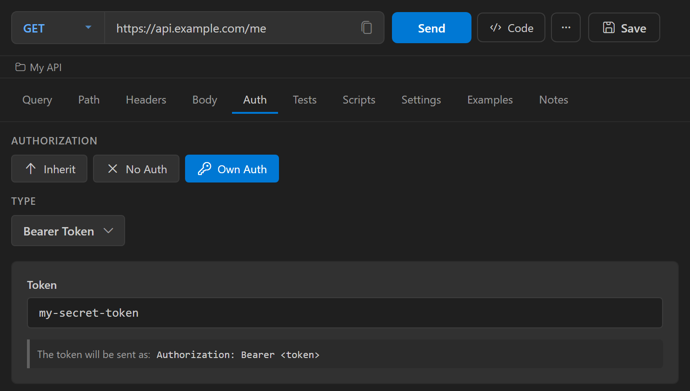

Configure authentication on the **Auth** tab of the request editor. The auth type you select decides which fields appear and how Nouto sends the credentials.

## Auth types

The **Type** dropdown offers these options:

| Type | Sends |
|------|-------|
| [Basic Auth](/authentication/basic) | A Base64-encoded `username:password` in the `Authorization` header |
| [Bearer Token](/authentication/bearer) | `Authorization: Bearer <token>` |
| [API Key](/authentication/api-key) | A key and value as a header or a query parameter |
| [OAuth 2.0](/authentication/oauth2) | An access token fetched from an OAuth 2.0 provider, as a Bearer header |
| [AWS Sig V4](/authentication/aws-signature) | AWS Signature Version 4 signing headers |
| [NTLM](/authentication/ntlm) | An NTLM handshake for Windows authentication |
| [Digest](/authentication/digest) | An HTTP Digest challenge-response handshake |
| No Auth | No credentials. Use it for public endpoints or when you set the auth header yourself on the **Headers** tab. |

## Select an auth type

1. Open a request and select the **Auth** tab.
2. If the request is saved in a collection, select **Own Auth** under **Authorization**. The **Inherit** and **No Auth** options hide the auth fields. See [Auth inheritance](/authentication/inheritance).
3. Select a type from the **Type** dropdown and fill in the fields that appear.

## Variables in auth fields

These fields resolve `{{variable}}` references when you send a request from the editor:

- **Username** and **Password** (Basic Auth, Digest, NTLM)
- **Token** (Bearer Token)
- **Key** and **Value** (API Key)

The fields on the OAuth 2.0 and AWS Sig V4 forms, and the NTLM **Domain** and **Workstation** fields, are sent as typed.

On the Basic Auth, Bearer Token, API Key, and Digest forms, an icon appears next to a field that contains a variable. Its color shows whether the variable resolves, and hovering it lists the variable names. See [Variable substitution](/variables/variable-substitution) for how Nouto looks up variable values.

## Auth inheritance

Requests in a collection can use the auth configured on their folder or collection instead of their own. Set credentials once on the collection and switch each request to **Inherit**. See [Auth inheritance](/authentication/inheritance).

## Credential storage

Password, secret key, and client secret fields are masked. The **Token** field of Bearer Token, the API Key **Value** field, and the AWS **Session Token** field show their values in plain text.

The desktop app saves auth credentials in the operating system keychain, and the collection file stores a reference to each one. A value that contains a `{{variable}}` reference stays in the collection file, because Nouto resolves it at send time.

The VS Code extension saves auth fields as plain text with the collection. To keep a secret out of the collection, store it in a [secret environment variable](/variables/secrets) and reference it from a field that resolves variables.
