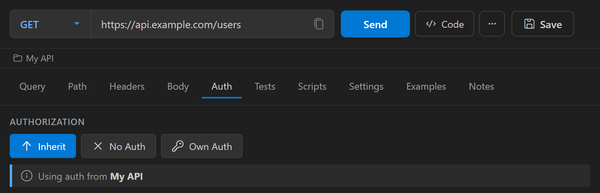
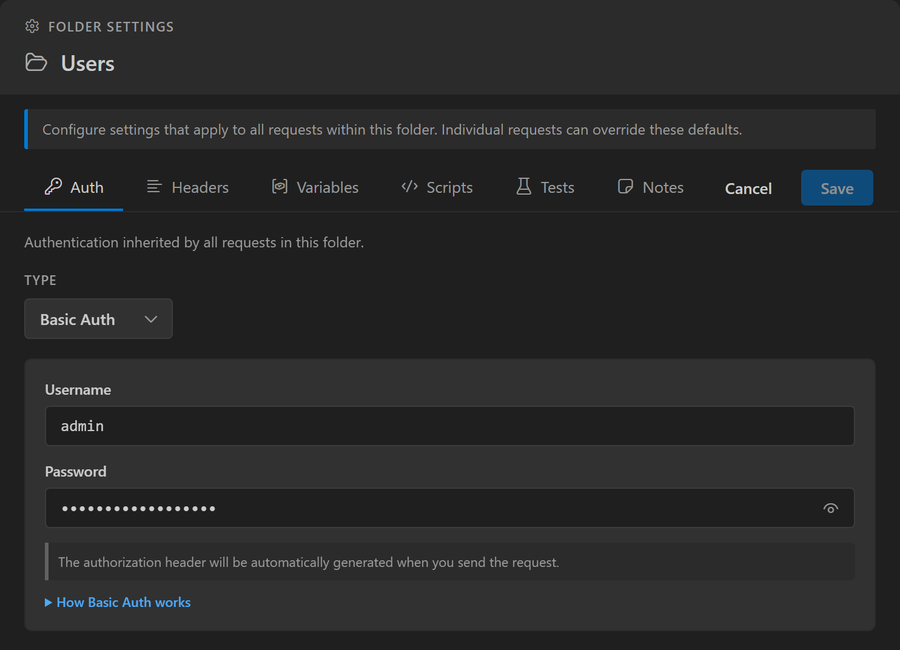

Auth inheritance lets you configure credentials once on a collection or folder instead of on every request. Each request in a collection chooses whether to inherit that auth, use its own, or send none.

## Inheritance modes

When a request is saved in a collection, its **Auth** tab shows an **Authorization** selector with three modes:

| Mode | Behavior |
|------|----------|
| **Inherit** | Uses the auth of the nearest folder or collection above the request that has auth configured. See [How Nouto finds inherited auth](#how-nouto-finds-inherited-auth). |
| **No Auth** | Sends no auth, even when a folder or collection above has auth configured. |
| **Own Auth** | Uses the auth configured on the request itself. This is the default. |

Requests start in **Own Auth** mode, including requests you create in a collection and requests imported from other tools. Switch each request that should use shared credentials to **Inherit**.

With **Inherit** selected, the tab shows `Using auth from` and the collection name. With **No Auth** selected, it shows `No authentication will be sent`. The auth fields appear only in **Own Auth** mode.



## Set auth on a collection or folder

1. In the sidebar, right-click the collection or folder and select **Settings...**.
2. On the **Auth** tab, select a type from the **Type** dropdown and fill in the fields.
3. Click **Save**.



Folders and collections don't have an inheritance mode of their own. Once you save auth on a folder, that folder provides auth to the inheriting requests inside it.

## How Nouto finds inherited auth

For a request in **Inherit** mode, Nouto checks the request's ancestors from the nearest folder upward:

1. The first folder with saved auth settings provides the auth.
2. If no folder above the request has saved auth settings, the collection's auth is used.
3. If the collection has no auth either, the request sends no auth.

:::caution
Saving a folder's settings saves its **Auth** tab too, even when you only changed its headers or variables. A folder saved with **No Auth** selected provides "no auth" to the requests below it, so they don't reach the collection's auth. To pass the collection's auth through, select the same auth type and credentials on the folder.
:::

## Inheritance example

In this collection, the collection has Bearer auth, Folder A has never had its settings saved, and Folder B has Basic auth saved:

```text
Collection (Bearer Token)
  └── Folder A (settings never saved)
        └── Request 0 (Inherit → collection's Bearer Token)
        └── Folder B (Basic Auth saved)
              └── Request 1 (Inherit → Folder B's Basic Auth)
              └── Request 2 (Own Auth: API Key → its own key)
              └── Request 3 (No Auth → no auth)
```

## Postman collections

When you import a Postman collection, Nouto keeps the auth configured on the collection. The desktop app also keeps the auth configured on folders. The VS Code extension doesn't import folder auth, so set it again in each folder's **Settings...**.

Postman requests that inherit auth from their parent are imported in **Own Auth** mode with **No Auth** selected. Switch them to **Inherit** after the import.
