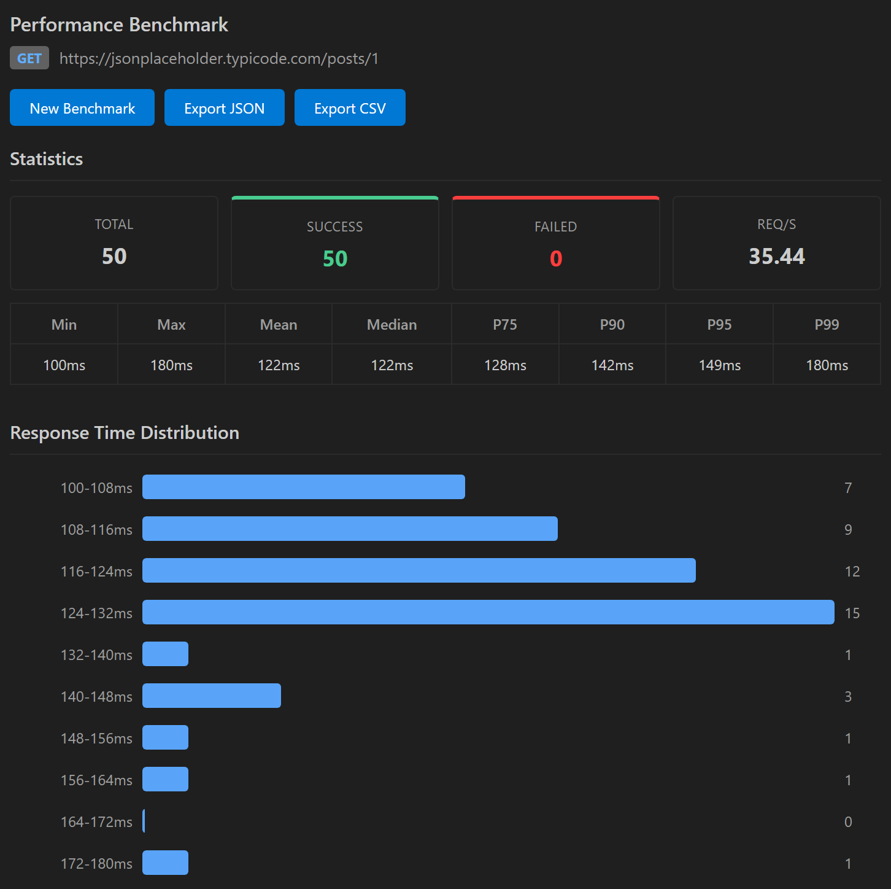

The benchmark tool sends one request many times and reports latency statistics. Use it to measure an endpoint's baseline response time, compare it before and after a change, or see how it behaves under concurrent load.

## Open the benchmark tool

Open the request you want to measure first. Then open the benchmark tool:

- In VS Code, click **More actions** (the `...` button next to **Send**) and select **Benchmark**.
- In the desktop app, click **Benchmark** in the left rail.

The benchmark panel shows the request's method and URL, and an environment selector in its toolbar.

## Configure the run

| Option | Description | Default | Range |
|--------|-------------|---------|-------|
| **Iterations** | Total number of requests to send | 10 | 1 to 10000 |
| **Concurrency** | Number of requests in flight at the same time | 1 | 1 to 100 |
| **Delay between (ms)** | Wait between requests. Shown only when **Concurrency** is 1. | 0 | 0 to 60000 |

With **Concurrency** set to 1, Nouto sends requests one after another, which measures latency without contention. Higher values simulate several clients calling the endpoint at once.

## Run the benchmark

Click **Run Benchmark**. A progress bar shows how many iterations have finished, and a table fills in with each result as it arrives. Click **Cancel** to stop early. A cancelled run still shows statistics for the iterations that finished, marked with a **Cancelled** badge.

## Read the results

When the run ends, the **Statistics** section shows these counts:

| Metric | Description |
|--------|-------------|
| **Total** | Number of iterations |
| **Success** | Iterations that succeeded |
| **Failed** | Iterations that failed |
| **Req/s** | Requests per second over the whole run |

Below the counts, a table shows response time statistics in milliseconds: **Min**, **Max**, **Mean**, **Median**, **P75**, **P90**, **P95**, and **P99**.

A distribution chart shows how response times spread across the run. The iteration table lists every request with its status, duration, size, result, and error, if any.

Click **New Benchmark** to change the settings and run again.

## Export results

Click **Export JSON** or **Export CSV** to save the results.

- The JSON file contains the request name, method, URL, run settings, statistics, and every iteration.
- The CSV file has one row per iteration, with the status, status text, duration, size, success flag, and error.

## Benchmark from the command line

To run benchmarks in CI, use the Nouto CLI. See [CLI: benchmark](/cli/benchmark).
