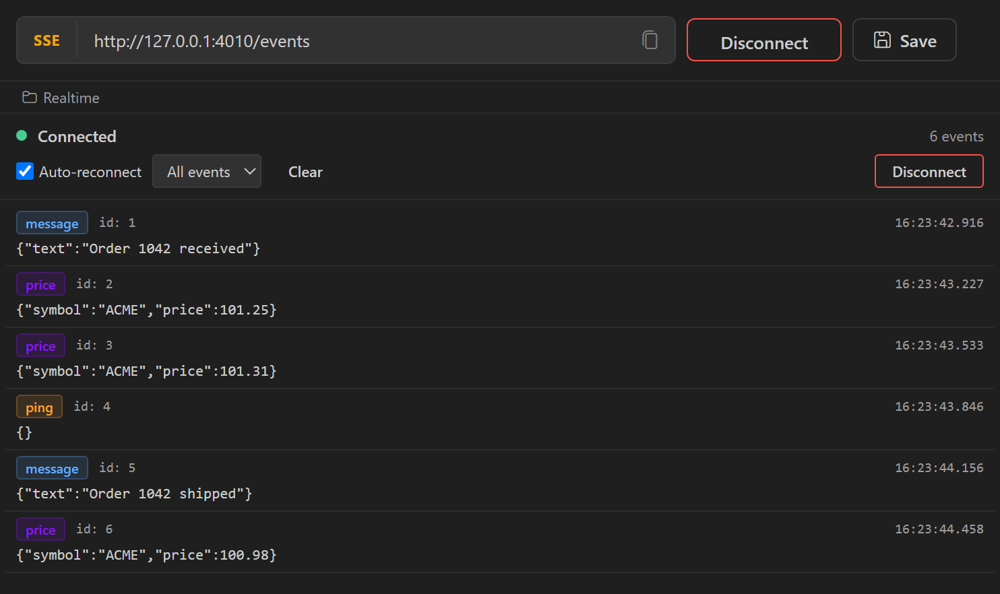

An SSE request opens a streaming HTTP connection to an endpoint that returns `text/event-stream` and lists each event as it arrives.

## Create an SSE request

Click the arrow next to **New Request** in the sidebar and select **New SSE Connection**. To add the request to a collection or folder, right-click it and select **New Request** > **SSE**.

An SSE request has no Params, Headers, or Auth tabs. The editor shows the SSE panel: a toolbar and the event log.

## Connect

1. Enter the endpoint URL, for example `https://api.example.com/events`. Add query parameters to the URL directly. `{{variables}}` in the URL are resolved from the active environment.
2. Click **Connect** in the panel toolbar.

Nouto sends a `GET` request with `Accept: text/event-stream` and `Cache-Control: no-cache`, plus any cookies from the active [cookie jar](/tools/cookie-jars) that match the URL. The status indicator shows `connecting` (orange), then `connected` (green). If the server returns an error status, the status changes to `error` and the toolbar shows the HTTP status.

To authenticate, put the token in the URL query string, for example `https://api.example.com/events?token={{token}}`, or store a session cookie in the active cookie jar.

## Read the event log

Each event row shows:

- The event type from the `event:` field, or `message` when the field is missing
- The event ID from the `id:` field, when present
- The time the event arrived, to the millisecond
- The data from the `data:` lines, joined with line breaks

Data longer than 200 characters is truncated. Click a long event to expand it. Expanded JSON data is pretty-printed.

Nouto skips comment lines (starting with `:`) and events that have no `data:` lines. The log keeps the 1,000 most recent events.

### Filter and clear events

After the first event arrives, a dropdown in the toolbar lists every event type received so far. Select a type to show only those events, or **All events** to show everything. Click **Clear** to empty the log.

## Reconnect automatically

The **Auto-reconnect** checkbox in the toolbar is on by default. Reconnect behavior differs by platform:

| Behavior | VS Code | Desktop app |
|----------|---------|-------------|
| Reconnects when | The stream ends or a network error occurs. A non-200 response stops the connection without a retry. | A connection attempt fails, the server returns a non-2xx status, or the stream ends |
| Delay | 3 seconds | 3 seconds |
| Attempt limit | None | 10 in a row |
| Sends `Last-Event-ID` | Yes, with the last `id:` received | No |

Nouto ignores the `retry:` field.

:::note
The **Connect** button in the URL bar and the `Ctrl+Enter` shortcut always turn auto-reconnect on. Use **Connect** in the panel toolbar to connect with auto-reconnect off.
:::

## Disconnect

Click **Disconnect** in the panel toolbar or the URL bar. The event log stays until you click **Clear**.
