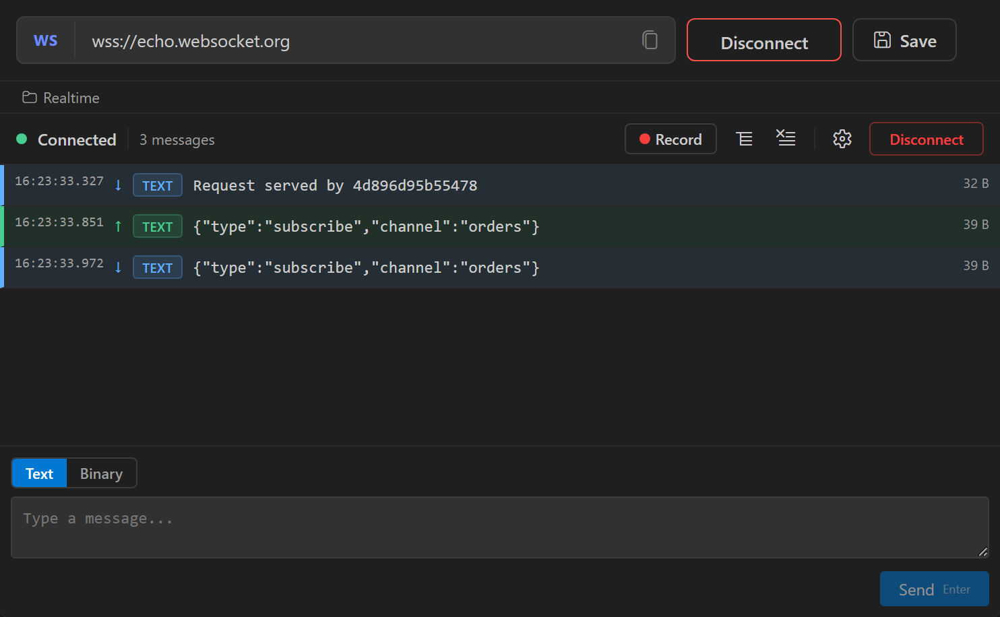

A WebSocket request opens a persistent connection, sends text or binary messages, and shows every sent and received message in a live log. You can record a session and replay its sent messages later.

## Create a WebSocket request

Click the arrow next to **New Request** in the sidebar and select **New WebSocket**. To add the request to a collection or folder, right-click it and select **New Request** > **WebSocket**.

A WebSocket request has no Headers, Auth, or Body tabs. The editor shows the WebSocket panel: a toolbar, the message log, and a message composer.

## Connect

1. Enter the server URL, for example `wss://echo.websocket.org`. `{{variables}}` in the URL are resolved from the active environment.
2. Click **Connect** in the panel toolbar.

The status indicator shows `connecting` (orange), then `connected` (green). If the connection fails, the status changes to `error` (red) and the toolbar shows the error message.

Nouto adds cookies from the active [cookie jar](/tools/cookie-jars) that match the URL to the upgrade request.

### Connection settings

Click the gear icon in the panel toolbar to set these options before you connect:

| Setting | Description |
|---------|-------------|
| **Protocols** | Comma-separated subprotocols sent in the `Sec-WebSocket-Protocol` header, for example `graphql-ws, chat` |
| **Auto-reconnect** | Reconnect automatically after the connection closes. Off by default. |
| **Interval (ms)** | Wait time before each reconnect attempt, from 500 to 60000. Defaults to 3000. |

Auto-reconnect behaves differently on each platform:

- In VS Code, Nouto reconnects each time the server closes the connection, with no attempt limit. It doesn't reconnect after a connection error.
- In the desktop app, Nouto reconnects after a failed attempt or a closed connection, up to 10 times in a row. The interval is capped at 30 seconds.

:::note
The **Connect** button in the URL bar and the `Ctrl+Enter` shortcut connect without subprotocols or auto-reconnect. Use **Connect** in the panel toolbar when you've changed the connection settings.
:::

## Send messages

Select the message type in the composer at the bottom of the panel:

- **Text** sends the message as a text frame.
- **Binary** sends a binary frame. Enter the payload as a base64 string. Nouto decodes it before sending.

Type the message and press `Enter`, or click **Send**. Press `Shift+Enter` to add a line break.

```json
{
  "type": "subscribe",
  "channel": "orders"
}
```

Nouto sends message text exactly as you type it. `{{variables}}` in a message aren't resolved.

## Read the message log

The log lists sent and received messages in order. Each row shows:

- The time, to the millisecond
- An arrow for the direction: up (green) for sent, down (blue) for received
- A `TEXT` or `BIN` badge. Received binary messages appear as base64.
- The message content
- The message size



Messages longer than 200 characters are truncated. Click a long message to expand it. An expanded JSON message is pretty-printed.

The log keeps the 1,000 most recent messages. Click the **Clear messages** icon in the toolbar to empty it.

## Disconnect

Click **Disconnect** in the panel toolbar or the URL bar. The status returns to `disconnected` and the message log stays until you clear it.

## Authenticate a WebSocket connection

Because WebSocket requests have no Auth or Headers tab, use one of these methods:

- Put the token in the URL query string, for example `wss://ws.example.com/socket?token={{token}}`.
- Send the token in a message after the connection opens, if your server's protocol expects it.
- Store a session cookie in the active cookie jar. Nouto sends matching cookies with the upgrade request.

## Record and replay sessions

A session is a recording of the messages sent and received over one connection, with their timing. Replay sends the recorded outgoing messages to the server again.

### Record a session

1. Connect to the server. The **Record** button appears in the toolbar only while you're connected.
2. Click **Record**. A pulsing dot shows that recording is on.
3. Send and receive messages as usual.
4. Click **Stop**. The Sessions drawer opens with a name field.
5. Enter a name and click **Save**, or click **Skip** to use a default name of `Session` followed by the date and time.

Nouto saves the session when you click either button. VS Code stores sessions in `.nouto/ws-sessions/` in the first workspace folder. The desktop app stores them in its app data folder. In VS Code, sessions are saved only when a workspace folder is open.

### Load a session

Click the **Sessions** icon in the toolbar to open the drawer. The **Saved Sessions** list shows each session's name, message count, duration, date, and URL.

- Click **Load** to load a session into the replay bar.
- Click **Delete** to remove a saved session.
- Click **Load from file** to load a session from a JSON file. Click **Save** in the replay bar to add it to the saved sessions.

### Replay a session

1. Connect to the server.
2. Load a session.
3. Choose a speed in the replay bar: `0.5x`, `1x`, or `2x`.
4. Click **Play**.

Nouto clears the message log, then sends the session's sent messages with their original delays adjusted for the chosen speed. Received messages in the recording aren't replayed. The progress bar and counter, for example `3/12`, track the replay. Click **Cancel** to stop it.

### Export a session

Load the session, then click **Export** in the replay bar and choose where to save the JSON file. Use **Load from file** to open it on another machine.
