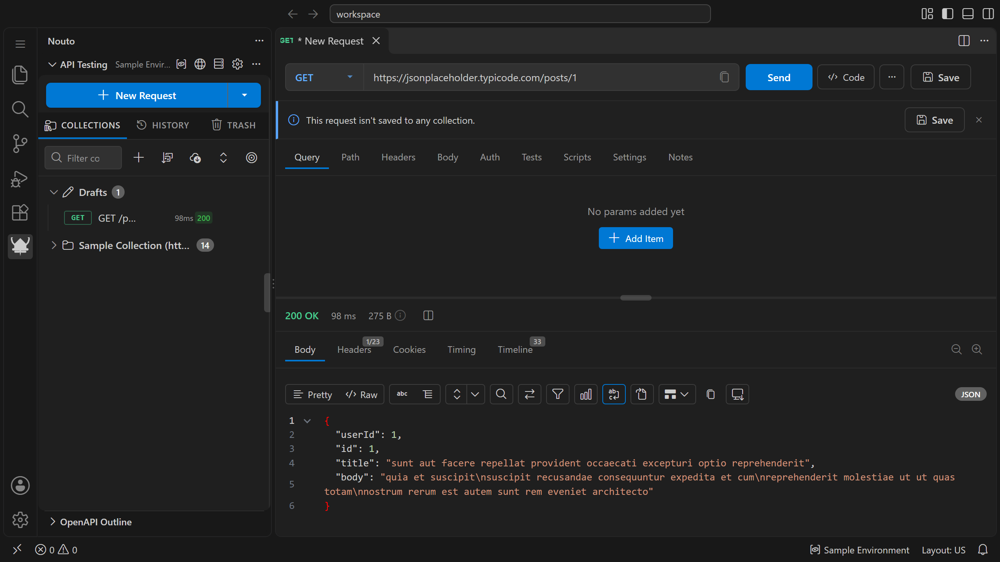

This guide takes you from a fresh install to a saved request that reads its base URL from an environment. Before you start, [install Nouto](/getting-started/installation/). On macOS, press `Cmd` wherever this guide says `Ctrl`.

## Send your first request

1. Open Nouto. In VS Code, click the **Nouto** icon in the activity bar. On desktop, launch the app.
2. Click **New Request** at the top of the sidebar, or press `Ctrl+N`.
3. Leave the method set to `GET`.
4. Enter this URL: `https://jsonplaceholder.typicode.com/posts/1`
5. Click **Send**, or press `Ctrl+Enter`.

The response panel shows the status `200 OK` and a JSON body with `userId`, `id`, `title`, and `body` fields.

## Save the request to a collection

1. In the Collections toolbar of the sidebar, click **New Collection** (the `+` icon).
2. Enter a name, for example `My API`, and click **Create**.
3. In your request, click **Save** next to **Send**.
4. Select `My API` in the list.

The request now appears under `My API` in the sidebar. When you change a saved request later, press `Ctrl+S` to save the changes.

## Use an environment variable

1. Open the Environments panel. In VS Code, run **Nouto: Environments** from the Command Palette, or choose **Manage Environments...** in the [environment picker](/variables/environments#activate-an-environment). On desktop, click **Environments** in the left rail.
2. Click **New environment**, then change the environment name to `Development`.
3. Add a variable named `baseUrl` with the value `https://jsonplaceholder.typicode.com`.
4. Click **Set active** next to `Development`.
5. In your request, change the URL to `{{baseUrl}}/posts/1` and send it again.

Nouto replaces `{{baseUrl}}` with the value from the active environment before it sends the request, so you get the same response as before.

## Next steps

- [Collections](/features/collections) covers folders, shared auth and headers, and the collection runner.
- [Environments](/variables/environments) covers global variables, secret variables, and variable priority.
- [Assertions](/testing/assertions) shows how to check responses automatically.
