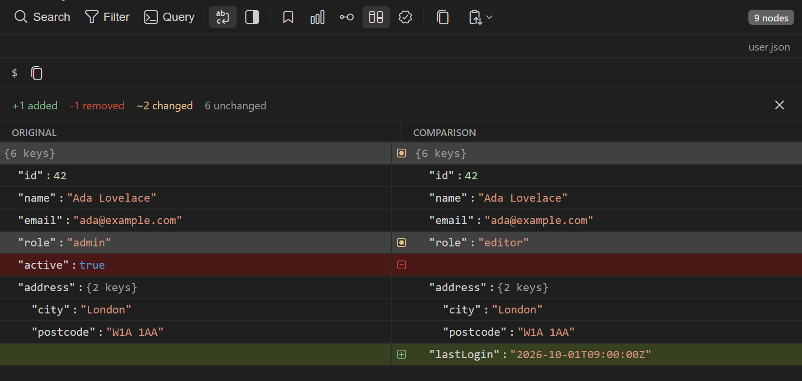

The JSON Explorer can diff the open document against a second JSON document that you paste or pick from disk. The diff lists every path in both documents and marks each one as added, removed, changed, or unchanged. Compare works in the JSON Explorer extension and in the [JSON Explorer](/response/json-explorer) inside Nouto.

:::tip
To compare an HTTP response with the previous response from the same request, use [Response diff](/response/response-diff) in the response panel instead.
:::

## Provide the second document

Click **Compare with another JSON** (the diff icon) in the explorer toolbar. The **Compare JSON** panel opens with a text area. Supply the second document in one of these ways:

- Paste JSON into the text area, then click **Compare**.
- Click **Paste from clipboard** to fill the text area, then click **Compare**. Some webviews block clipboard access. If that happens, the panel says so and you can paste into the text area directly.
- Click **Choose file...** and pick a file. The diff opens as soon as Nouto reads the file.

The text area accepts a single JSON document. If the text doesn't parse, the panel shows the parse error and keeps your text so you can fix it.

**Choose file...** accepts these file types:

| Where you use it | File types |
|------------------|------------|
| JSON Explorer extension | `.json`, `.jsonl`, `.ndjson` |
| Nouto desktop app | `.json`, `.jsonl`, `.ndjson` |
| Nouto VS Code extension | `.json` |

If Nouto can't read the file or the file isn't valid JSON, a notification reports the error and the **Compare JSON** panel stays open.

## Read the diff

The diff view replaces the tree. The open document is in the **Original** column and the second document is in the **Comparison** column. A summary bar at the top counts the paths in each state:

| Indicator | Meaning |
|-----------|---------|
| `+N added` | Paths that exist only in the comparison document |
| `-N removed` | Paths that exist only in the original document |
| `~N changed` | Paths that exist in both documents with a different value or type |
| `N unchanged` | Paths that are identical in both documents |

Each row shows the value from each side and an icon for its state. Objects appear as `{N keys}`, arrays as `[N items]`, and values longer than 60 characters are cut short.

The counts include objects and arrays as well as the values inside them:

- An object counts as changed when anything inside it changed.
- An array counts as changed when its length changed.
- The diff compares arrays position by position. An item inserted at the start of an array therefore marks every later item as changed.

## Close the diff

Click the close button in the summary bar to discard the comparison document and return to the tree view. Loading new data into the explorer also clears the comparison, for example when you send the request again or the file changes on disk.
