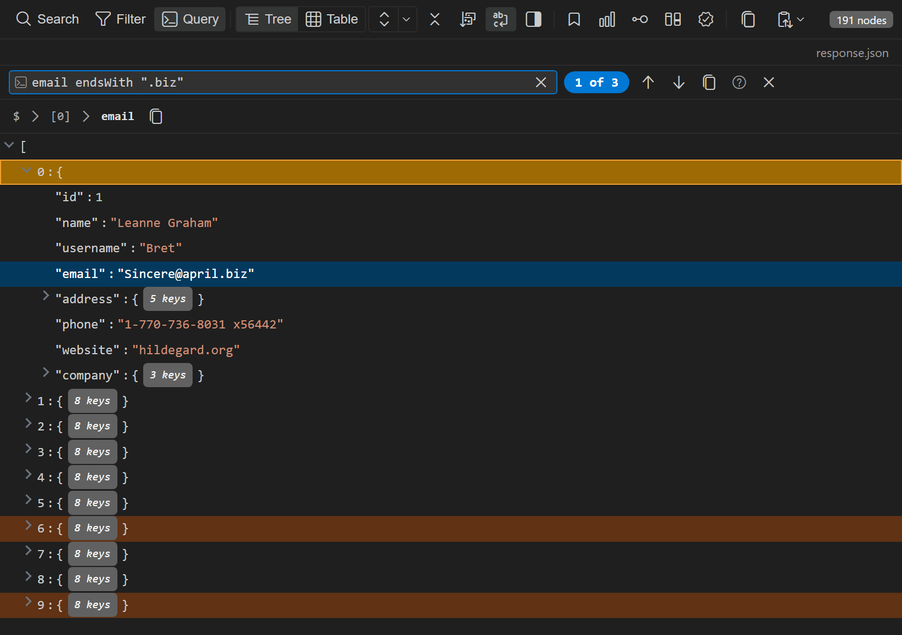

The query filter finds the items in a JSON array whose fields match a condition, for example every user older than 30 or every order whose status is `"shipped"`. It works the same in the JSON Explorer extension and in the [JSON Explorer](/response/json-explorer) inside Nouto.

Press `Ctrl+Shift+K` (`Cmd+Shift+K` on macOS) or click **Query** in the explorer toolbar to open the query bar. The explorer runs the query when you stop typing. Press `Enter` to run it immediately.

:::tip
The query filter and the [JSONPath filter](/response/json-explorer#jsonpath-filter) (`Ctrl+/`) are separate tools. The query filter tests fields against values, for example `age > 30`. The JSONPath filter selects nodes by path, for example `$.data[*].name`.
:::

## What a query tests

When the root of the document is an array, the query tests each item of that array. When the root is an object, the query tests the root object.

The query does not test the items of arrays nested deeper in the document. To check values inside a nested array, use an array path such as `tags[*]` or `items[0].name`. See [Field paths](#field-paths).

## Operators

Each condition has the form `field operator value`.

| Operator | Matches when the field value |
|----------|------------------------------|
| `=` | Equals the value |
| `!=` | Does not equal the value |
| `>` | Is a number greater than the value |
| `<` | Is a number less than the value |
| `>=` | Is a number greater than or equal to the value |
| `<=` | Is a number less than or equal to the value |
| `~` | Matches a JavaScript regular expression |
| `contains` | Contains the text |
| `startsWith` | Starts with the text |
| `endsWith` | Ends with the text |

The operators differ in how they compare:

- `=` and `!=` compare loosely, so `age = 30` also matches an item whose `age` is the string `"30"`.
- `>`, `<`, `>=`, and `<=` match only fields whose value is a number.
- `~`, `contains`, `startsWith`, and `endsWith` ignore letter case.
- Operator and combinator keywords are not case-sensitive. `contains`, `CONTAINS`, `AND`, and `and` all work.

## Values

- Put strings in double quotes: `"active"`.
- Write numbers, `true`, `false`, and `null` without quotes.
- Inside a string, a backslash escapes the next character. To put a backslash into a regular expression, type two backslashes: `url ~ "\\.json$"`.

## Field paths

A field path names the value to test inside each item:

- Use dot notation for nested objects: `address.city`.
- Use an index in brackets for an array element: `tags[0]`.
- End a path with `[*]` to test every element of an array. The condition matches when any element matches: `tags[*] = "urgent"`. The explorer ignores anything after `[*]`, so `items[*].name` compares whole items rather than their names.
- Field names can contain letters, digits, `_`, and `$`. A key that contains other characters, such as a hyphen or a space, can't be used in a query.

An item that doesn't have the field never matches the condition, not even with `!=`. To match items where a field is missing or has a different value, use `NOT`: `NOT status = "archived"`.

## Combine conditions

Join conditions with `AND` and `OR`, negate a condition with `NOT`, and group conditions with parentheses:

```text
status = "active" AND (role = "admin" OR role = "owner")
NOT status = "archived"
```

Without parentheses, `NOT` applies first, then `AND`, then `OR`. For example, `a OR b AND c` means `a OR (b AND c)`.

## Examples

| Query | Finds items where |
|-------|-------------------|
| `name contains "john"` | `name` includes `john` in any letter case |
| `address.city = "Berlin"` | The nested `city` field is `Berlin` |
| `email startsWith "admin"` | `email` starts with `admin` |
| `age >= 18 AND status = "active"` | Both conditions match |
| `type = "admin" OR type = "moderator"` | Either condition matches |
| `(age > 30 OR role = "admin") AND active = true` | The grouped condition and `active = true` both match |
| `name ~ "^the"` | `name` starts with `the` in any letter case |
| `status ~ "^(ended\|canceled)$"` | `status` is exactly `ended` or `canceled` in any letter case |
| `code ~ "^\\d{3,5}$"` | `code` is 3 to 5 digits |
| `tags[*] = "urgent"` | Any element of `tags` is `urgent` |
| `email != null` | `email` exists and is not `null` |
| `NOT status = "deleted"` | `status` is missing or is not `deleted` |

## Autocomplete

The query bar suggests completions as you type:

- At the start of a query and after `AND`, `OR`, `NOT`, or `(`, it suggests field names taken from the first 10 items.
- After a field name, it suggests operators.
- After a value, it suggests combinators.

Press `Tab` to insert the first suggestion, or use the arrow keys to pick one and press `Enter`. Press `Escape` to hide the suggestions.

## Step through matches

The explorer highlights every matching item in the tree view and the table view, and marks the current match more strongly. A badge such as `1 of 12` shows your position.



Press `Enter` for the next match and `Shift+Enter` for the previous one, or use the arrow buttons in the query bar. Each step expands the collapsed ancestors of the match and scrolls to the first field that matched.

To hide rows that don't match in the table view, open the search bar with `Ctrl+F` and switch it to filter mode.

Click the copy button in the query bar to copy the matching items to the clipboard as a JSON array. Press `Escape` in the query bar to close it and clear the highlights.

## Query reference panel

Click **?** in the query bar to open the **Query Reference** panel. It lists every operator and combinator with example queries, so you can check syntax without leaving the explorer.
