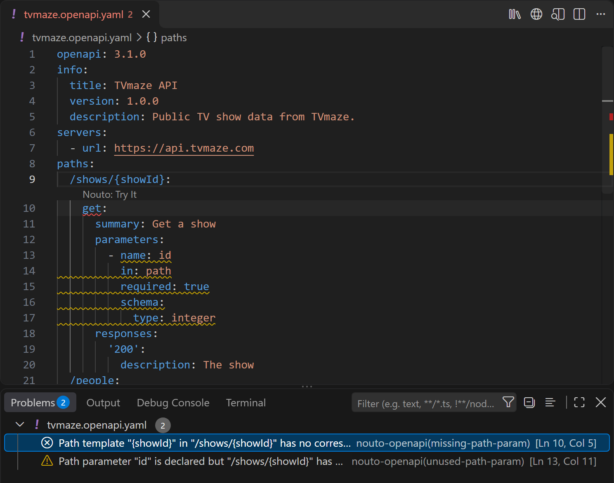
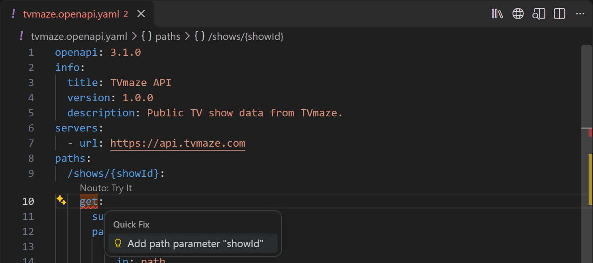

Nouto checks an OpenAPI spec as you type and underlines each problem in the editor. In VS Code, the problems also appear in the **Problems** panel with the source `nouto-openapi`. Many problems have a quick fix: place the cursor on the problem, then click the lightbulb or press `Ctrl+.` (`Cmd+.` on macOS). Each fix applies as a single undo step.

## Diagnostic sources

Diagnostics come from these checks:

| Check | What it reports | Can you turn it off? |
|-------|-----------------|----------------------|
| Syntax | YAML or JSON that does not parse | No |
| Structure | Version, root sections, path parameters, and operation IDs. See [Structural diagnostics](#structural-diagnostics) | No |
| References | Missing or circular `$ref` targets. Cross-file targets are checked when [external references](/openapi/external-refs) are on | Cross-file checks only, with **Resolve external $refs** |
| Meta-schema | Anything the official OpenAPI JSON Schema rejects | No |
| Lint | The rules described in [Linting](/openapi/linting) | Yes, per rule or all at once |

## Structural diagnostics

These checks always run. The code appears with each diagnostic.

| Code | Severity | Meaning |
|------|----------|---------|
| `root-not-object` | Error | The document root is not an object |
| `unrecognized-version` | Error | The `openapi` field is missing or is not a 3.0.x, 3.1.x, or 3.2.x version |
| `unsupported-version-fallback` | Information | The document declares a later 3.x version, which Nouto treats as 3.2 |
| `missing-root-sections` | Error | The document has none of `paths`, `components`, or `webhooks` |
| `additional-op-duplicate` | Error | An `additionalOperations` entry uses a method that has its own fixed key, such as `GET`. Use the fixed key (`get`) instead |
| `duplicate-operation-id` | Error | More than one operation uses the same `operationId` |
| `unused-path-param` | Warning | An `in: path` parameter's name does not appear in the path template |
| `missing-path-param` | Error | The path template contains `{name}` but the operation has no matching `in: path` parameter |
| `ref-not-found` | Error | An internal `$ref`, such as `#/components/schemas/User`, points to something that does not exist |
| `external-ref-unsupported` | Warning | A `$ref` points outside the file and Nouto is not resolving it, either because external references are off or because the `$ref` uses a URL or an absolute path |

A circular chain of internal references is also reported as an error.

## Meta-schema validation

Nouto validates the document against the official OpenAPI JSON Schema for its declared version: 3.0, 3.1, or 3.2. This catches property names the version does not allow, values of the wrong type, and missing required fields. When the document declares a later 3.x version that Nouto treats as 3.2, meta-schema validation is skipped, so fields added in the newer version are not flagged as errors.

## When diagnostics update

Nouto re-checks the document after you stop typing: 400 milliseconds after the last edit in VS Code, and 300 milliseconds in the desktop app. Each check runs in two passes:

1. The first pass reports syntax errors, structural diagnostics, and lint findings. In VS Code it also runs meta-schema validation and the two example lint rules.
2. The second pass resolves cross-file `$ref` targets and replaces the `external-ref-unsupported` warnings with definite results. In the desktop app, meta-schema validation and the example lint rules also run in this pass, so their results appear a moment after the others.

When you edit an open file that other open specs reference, Nouto re-checks those specs too. Changing a lint setting re-checks every open spec immediately.

## Structural quick fixes

These fixes resolve structural diagnostics:

| Diagnostic | Fix |
|------------|-----|
| `missing-root-sections` | Add an empty `paths` object |
| `duplicate-operation-id` | Rename the `operationId` to a unique name |
| `unused-path-param` | Remove the unused path parameter |
| `missing-path-param` | Add a path parameter for the missing `{name}` |
| `ref-not-found` | Create the missing component, using a skeleton for its section |

The `ref-not-found` fix is offered only when the `$ref` targets a component, in the form `#/components/<section>/<name>`.

## Lint rule quick fixes

41 of the [lint rules](/openapi/linting) have a quick fix. The **Fix** column on the Linting page shows which rules have one.

| Rule | Fix |
|------|-----|
| `api-key-in-query` | Move the API key to `in: header` |
| `server-uses-http` | Change the server URL to `https://` |
| `server-url-has-credentials` | Remove the `user:pass@` part from the server URL |
| `operation-missing-4xx` | Add a `default` response with the description `Unexpected error` |
| `operation-missing-5xx` | Add the same `default` response. When both rules fire on one operation, the fix is offered once |
| `parameter-unbounded` | Add `maxLength: 255` to a string parameter, or `maxItems: 100` to an array parameter |
| `schema-unconstrained-additional-properties` | Set `additionalProperties: false` |
| `missing-info-description` | Add an `info.description` built from `info.title` |
| `operation-missing-description` | Add a `summary` built from the `operationId`, or from the method and path when there is no `operationId` |
| `operation-missing-tags` | Add a tag named after the first static path segment |
| `operation-missing-operation-id` | Add an `operationId` built from the method and path |
| `operation-without-security` | Require one of the document's security schemes for this operation, or for all operations. One fix is offered per scheme |
| `unused-component-schema` | Remove the unused schema |
| `rate-limit-headers` | Add `X-RateLimit-Limit`, `X-RateLimit-Remaining`, and `X-RateLimit-Reset` headers to the operation's 2xx responses |
| `info-missing-contact` | Add `info.contact` with the name `API Support` |
| `info-missing-license` | Add `info.license` for Apache 2.0, with its URL |
| `operation-tag-undefined` | Declare the tag in the root `tags` list |
| `tag-duplicate-name` | Remove the later duplicate tag entry |
| `tag-missing-description` | Add a description built from the tag name |
| `operation-duplicate-parameter` | Remove the duplicate parameter |
| `path-key-trailing-slash` | Rename the path key without the trailing slash |
| `path-key-has-query` | Rename the path key without the query string |
| `server-url-trailing-slash` | Remove the trailing slash from the server URL |
| `servers-empty` | Add a placeholder server with the URL `https://api.example.com` |
| `server-variable-undefined` | Declare the missing server variable. One fix is offered per variable |
| `enum-duplicate-values` | Remove every duplicate value from the enum in one edit |
| `schema-required-property-undefined` | Define the property as a `string`, or remove it from `required` |
| `schema-nullable-in-31` | Replace `nullable: true` with a `"null"` entry in `type` |
| `ref-has-siblings` | Remove the keys next to `$ref` |
| `example-value-and-external-value` | Remove `externalValue` and keep `value` |
| `unused-component` | Remove the unused component |
| `owasp-integer-unbounded` | Add `minimum: 0` and `maximum: 1000000` where they are missing |
| `owasp-integer-no-format` | Add `format: int64` |
| `owasp-string-unrestricted` | Add `maxLength: 255` |
| `owasp-array-unbounded` | Add `maxItems: 100` |
| `owasp-response-401-missing` | Add a `401` response |
| `owasp-response-429-missing` | Add a `429` response with a `Retry-After` header |
| `owasp-response-500-missing` | Add a `500` response |
| `owasp-429-retry-after` | Add a `Retry-After` header to the `429` response |
| `owasp-jwt-best-practices` | Add a sentence about RFC 8725 to the security scheme's description |
| `owasp-unsafe-operation-unprotected` | Require one of the document's security schemes for the operation, or for all operations |

The bounds and placeholder values these fixes insert are starting points. Replace them with your API's real limits and contact details.

The `parameter-unbounded`, `rate-limit-headers`, and `owasp-429-retry-after` fixes skip parameters and responses defined through `$ref`, because the referenced definition may be shared by other operations. No fix is offered when the edit would land inside flow-style YAML, such as `{ type: string }` or `[a, b]`.

## Cross-file quick fixes

When [external references](/openapi/external-refs) are on, two more fixes repair broken cross-file references, in both VS Code and the desktop app:

| Diagnostic | Fix | Effect |
|------------|-----|--------|
| `external-file-not-found` | **Create missing file** | Create the referenced file. When the `$ref` targets a component in that file, the new file already contains a skeleton for it |
| `external-pointer-not-found` | **Create missing component** | Add the missing component to the referenced file. Offered when the target has the form `#/components/<section>/<name>` |
