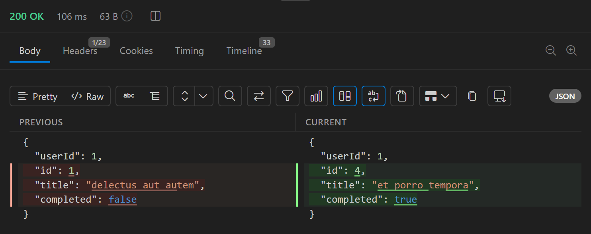

The response diff shows the current JSON response next to the previous one, with changed lines highlighted. Use it to see how an endpoint's output changes when you resend a request, edit it, or switch environments.

:::tip
To compare two arbitrary JSON documents instead of two responses, use [Compare](/json-explorer/compare) in the JSON Explorer.
:::

## Open the diff

1. Send a request that returns JSON.
2. Send the request again. You can change the request or the active environment first.
3. In the **Body** tab, click **Compare with previous response** (the diff icon) in the body toolbar. In a narrow response panel, open **More actions** and select **Compare**.

The button appears only for JSON responses viewed in the text view, and only when Nouto has a previous response to compare with.

## Read the diff

The diff replaces the body text. The previous response is in the **Previous** column on the left, and the current response is in the **Current** column on the right. Both sides keep JSON syntax highlighting.

Lines that differ are highlighted on both sides, and the changed text inside each line is marked. Long lines wrap.

If a [JSONPath filter](/response/response-viewer#jsonpath-filter) is active, the **Current** column shows the filtered result while the **Previous** column shows the whole previous body. Clear the filter before you compare full responses.

## Close the diff

Click **Compare with previous response** again, or click **Tree view**, to return to the normal body view.

## Which response counts as previous

Nouto keeps one previous response: the body that was on screen when the new response arrived. It isn't saved, so restarting Nouto discards it.

Nouto doesn't keep the result of a failed request as the previous response. The desktop app also doesn't keep responses with a 4xx or 5xx status.

To compare two environments, send the request with one environment active, switch the active environment, and send it again.
