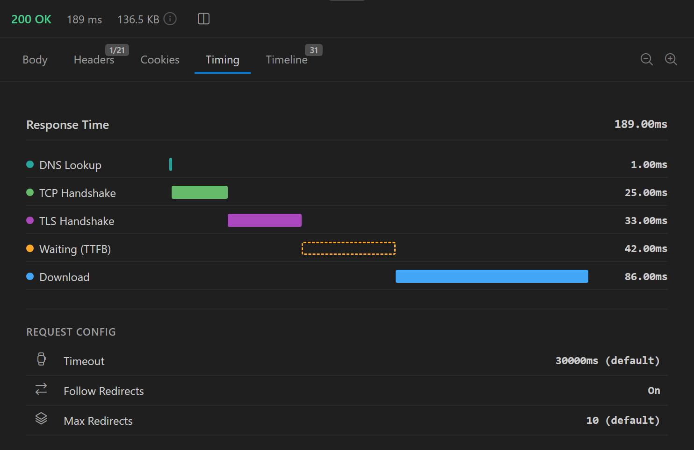

The **Timing** tab in the response panel shows where the time for the last request went. It draws a waterfall chart with one bar per phase and lists the timeout and redirect settings the request used.

## Read the waterfall

Send a request and click the **Timing** tab. The top of the tab shows the total **Response Time**. Below it, each phase has a bar and a duration:

| Phase | What it covers |
|-------|----------------|
| **DNS Lookup** | Resolving the hostname to an IP address |
| **TCP Handshake** | Opening the TCP connection to the server |
| **TLS Handshake** | Negotiating TLS for an HTTPS request |
| **Waiting (TTFB)** | Time to first byte: from sending the request until the response starts to arrive |
| **Download** | Receiving the response body |

Each bar starts where the previous one ends. A phase that took 0 ms shows **Cache** instead of a duration. Expect this for **DNS Lookup**, **TCP Handshake**, and **TLS Handshake** when a request reuses an open connection, and for **TLS Handshake** on plain HTTP requests.

If the request failed before the server responded, the tab shows `No timing data available` instead of the chart.

## Request config

Below the chart, **Request Config** lists the settings that applied to the request:

| Setting | Value shown |
|---------|-------------|
| **Timeout** | The request's timeout, or `30000ms (default)` |
| **Follow Redirects** | **On** or **Off** |
| **Max Redirects** | The redirect limit, or `10 (default)`. Shown only when **Follow Redirects** is on. |

To change these settings, see [Timeouts and redirects](/building-requests/timeouts-redirects).

## How each platform measures timing

The VS Code extension and the desktop app measure the phases differently, so compare timings within one platform.

In the VS Code extension, Nouto records each phase from the events of the connection itself:

- When the request is redirected, or when Digest auth sends it a second time, the phases describe the final request only. **Response Time** covers the whole exchange.
- NTLM requests have no phase breakdown. The whole duration appears as **Waiting (TTFB)**.
- When a request goes through a proxy, **DNS Lookup** and **TCP Handshake** measure the connection to the proxy, not to the origin server.

In the desktop app, only **DNS Lookup**, **Waiting (TTFB)**, and **Download** are measured:

- **DNS Lookup** is a separate lookup of the hostname that Nouto runs just before it sends the request.
- **Waiting (TTFB)** runs from sending the first request until its response headers arrive. It therefore includes setting up the connection.
- **TCP Handshake** and **TLS Handshake** are estimates. Nouto takes the **Waiting (TTFB)** time minus the **DNS Lookup** time and splits it 40% to TCP and 60% to TLS for HTTPS. For plain HTTP, all of it goes to TCP.
- Time spent following redirects counts toward **Response Time** but not toward any phase.

Because of the estimates, the desktop bars can add up to more than the **Response Time**.

## Find the slow phase

A long phase points to where to look:

| Long phase | Where to look |
|------------|---------------|
| **DNS Lookup** | The DNS resolver, or a hostname that isn't cached yet |
| **TCP Handshake** | Network distance or routing to the server |
| **TLS Handshake** | The TLS setup. A reused connection skips this phase. |
| **Waiting (TTFB)** | The server's processing time for the request |
| **Download** | The size of the response body or the available bandwidth. Compare it with the size in the status line. |

On desktop, use **Waiting (TTFB)** rather than the TCP and TLS bars, because those are estimates.
