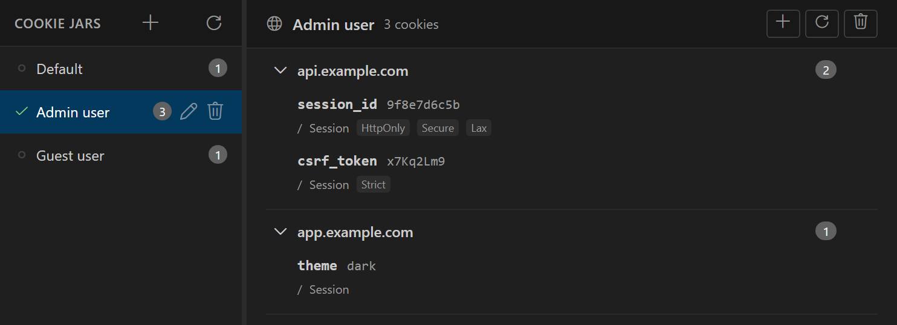

Nouto saves the cookies that servers set with `Set-Cookie` headers and sends them with later requests to matching URLs. It keeps cookies in cookie jars. A jar is a named set of cookies, so you can keep one jar per session, for example an admin user and a guest user, and switch between them.

## Open the cookie jars

Open the Environments panel and select the **Cookie Jar** tab. See [Environments](/variables/environments) for how to open the panel.

In VS Code, you can also click **Cookie Jars** (the globe icon) in the API Testing view's title bar, or run **Nouto: Cookie Jars** from the Command Palette. Both open the Environments panel on the **Cookie Jar** tab.

The tab lists your jars, with the cookie count of each. Nouto starts with one jar named `Default`. A check mark shows the active jar.



## Create and switch jars

Only one jar is active at a time, and it applies to every request.

- To create a jar, click **New jar** at the top of the jar list, type a name, and press `Enter`.
- To make a jar active, click it in the list. The right pane shows its cookies, grouped by domain.
- To rename or delete a jar, use the buttons on its row. You can't delete the last jar.

In the desktop app, you can also switch jars from the cookie jar selector in the top toolbar.

## How Nouto sends and stores cookies

Before Nouto sends an HTTP, GraphQL, WebSocket, SSE, or GraphQL subscription request, it adds a `Cookie` header with the active jar's cookies that match the URL. A cookie matches when:

- Its domain equals the URL's host, or the host is a subdomain of it. A cookie for `example.com` matches `api.example.com`.
- The URL's path starts with the cookie's path.
- It hasn't expired.
- It isn't marked `Secure`, or the URL uses `https://`.

If the request already has an enabled `Cookie` header, Nouto leaves it as it is and adds no cookies.

When an HTTP response contains `Set-Cookie` headers, Nouto saves those cookies to the active jar. A new cookie replaces an existing one with the same name, domain, and path. Nouto deletes cookies that have expired, so a server can remove a cookie by setting an expiry date in the past.

The [CLI](/cli/run) doesn't use your cookie jars. Each `nouto run` starts with an empty jar that lasts for that run.

## Edit cookies by hand

To test a specific cookie value without signing in, add the cookie yourself:

1. In the jar list, click the jar to make it active.
2. Click **Add cookie** above the cookie list.
3. Fill in **Name** and **Domain**, which are required, and any of **Value**, **Path**, **Expires**, **HttpOnly**, **Secure**, and **SameSite**.
4. Click **Add**.

Each cookie row has **Edit cookie** and **Delete cookie** buttons. Each domain group has a button that deletes every cookie for that domain. **Clear all cookies** empties the jar.

## Cookies tab in the response panel

The response panel's **Cookies** tab shows the cookies of the last request in two sections:

- **Sent Cookies** lists the cookies in the request's `Cookie` header.
- **Response Cookies** lists the cookies from the response's `Set-Cookie` headers, with flags such as **Session**, **HttpOnly**, **Secure**, and **Deleted**, and their attributes.

## Use a cookie value in a request

To put a cookie's value in a header, URL, or body, use `{{$cookie.name}}`:

```http
X-CSRF-Token: {{$cookie.csrfToken}}
```

Nouto uses the first cookie with that name in the active jar, whatever its domain or path.

## Read and change cookies in scripts

Scripts can read, add, and delete cookies in the active jar with `nt.cookies`. See [Cookie script API](/tools/cookie-script-api).

## Back up cookie jars

Nouto backups can include your cookie jars. Cookies often hold session tokens, so store backup files somewhere safe. See [Backup and restore](/import-export/backup-restore).
